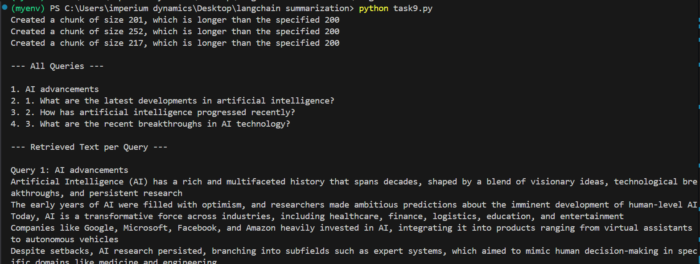
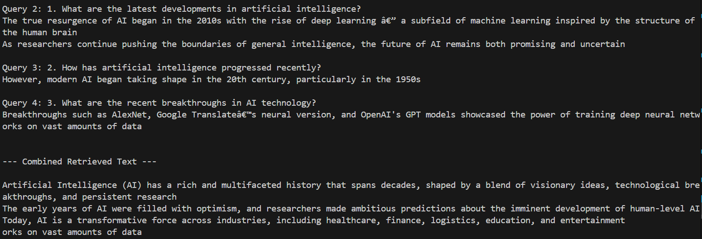
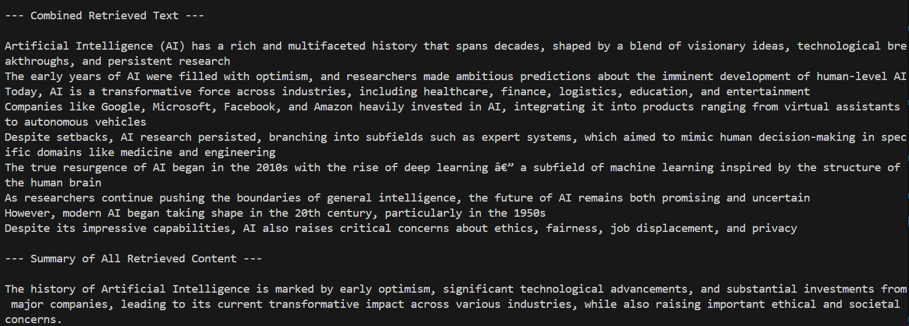

# LangChain Summarization ProjectA project to master LangChain through structured tasks. 
Contributor: - Hairam Naseem

Task 2 output:

Task 3 output:

Task 4 output:

Task 5 output:

Task 6 output:

Task-7 output:

Task 8 output:

Task 9 output:

